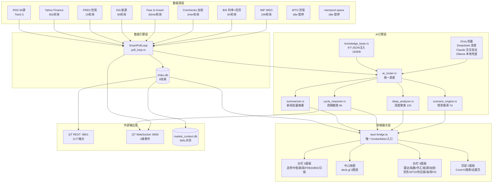
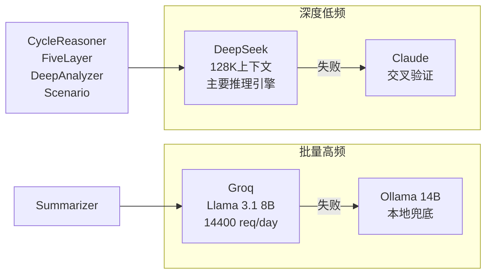
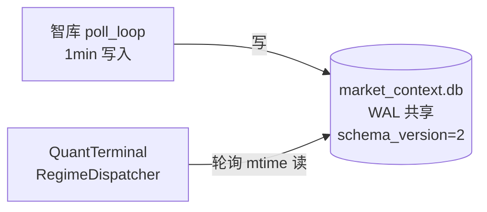

# 智库 · 项目全景图

> 自动生成，@cross-checker 维护。最后更新：2026-03-22
> 技术细节参考：`.team-logs/wiring-registry.md`
> 代码证据基准：src-tauri/src/ + src/

---

## 一、项目定位

**全球金融情报中枢** — Tauri v2 桌面应用，借鉴 World Monitor UI 模式，聚合 10+ 全球数据源，驱动 AI 金融周期推理引擎，向 QuantTerminal 量化终端供应决策因子。

**关键数字（实测，2026-03-22）：**

| 维度 | 数值 |
|------|------|
| Rust 服务文件 | 38 个 |
| Rust 总代码行 | 12,232 行（services）+ 2,122 行（commands+models）|
| TypeScript 总代码行 | 1,244 行（tauri-bridge）+ 3,409 行（panels）|
| Tauri Command 数 | 43 个（已注册入 lib.rs）|
| 前端面板数 | 16 个（含浮层）|
| RSS 数据源数 | 60 个（38 直连 + 22 RSSHub 代理）|
| 数据库表数 | 8 张（zhiku.db）+ 1 张（market_context.db）|
| 知识库 JSON | 8 个，合计 183 KB（编译进二进制）|
| QT REST 端点 | 11 个（port 9601）|
| QT WebSocket 事件 | 3 类（port 9600）|

---

## 二、系统架构总览

---

## 三、数据源清单

扫描依据：`src-tauri/src/services/poll_loop.rs`（spawn task）+ `rss_fetcher.rs:29`（RSS_SOURCES 数组）

| 数据源 | 服务文件 | 状态 | 拉取频率 | 写入表 |
|--------|---------|------|---------|--------|
| RSS 60源（38直连 + 22 RSSHub） | rss_fetcher.rs | online | 5 分钟 | news |
| Yahoo Finance | yahoo_client.rs | online | 1 分钟 | market_snap |
| FRED（需 API Key） | fred_client.rs | online/idle | 1 小时 | macro_data |
| EIA（需 API Key） | eia_client.rs | online/idle | 6 小时 | macro_data |
| Fear & Greed | fear_greed_client.rs | online | 30 分钟 | macro_data |
| CoinGecko | coingecko_client.rs | online | 2 分钟 | market_snap |
| BIS（利率 + 信贷） | bis_client.rs | online | 6 小时 | macro_data |
| IMF WEO | imf_client.rs | online | 24 小时 | macro_data |
| WTO 贸易 | wto_client.rs | idle | 24 小时 | — |
| mempool.space | mempool_client.rs | idle | 5 分钟 | — |

**注：** WTO 和 mempool 的 poll task 已 spawn 但立即返回（`poll_loop.rs:814-829` 注明"paused — no consumer in reasoning chain"）。

---

## 四、数据库表清单

扫描依据：`src-tauri/src/services/db.rs:10`（MIGRATION_SQL）+ `market_context.rs:23`

### zhiku.db（主数据库）

| 表名 | 核心字段 | 写入方 | 读取方 | 行数级别 |
|------|---------|--------|--------|---------|
| news | id, url, title, source, source_tier, category, published_at, sentiment_score, ai_summary | rss_fetcher | commands/news.rs | 万级（~6000+）|
| market_snap | symbol, price, change_pct, volume, timestamp, source | yahoo_client, coingecko_client | commands/market_data.rs | 十万级（~42000+）|
| macro_data | indicator, value, period, source, fetched_at | fred_client, eia_client, fear_greed_client, bis_client, imf_client | commands/macro_data.rs, indicator_engine.rs | 千级 |
| ai_analysis | id, analysis_type, input_ids, output, model, confidence, reasoning_chain, source_urls | summarizer, deep_analyzer | commands/ai.rs, qt_rest.rs | 千级 |
| signals | id, signal_type, severity, title, summary, pushed_to_qt | alert_engine | commands/ai.rs | 百级 |
| api_status | service, status, last_check, last_error, response_ms | poll_loop（每次拉取后更新）| commands/api_status.rs | 20 行以内（每服务一行）|
| reasoning_scorecard | reasoning_id, confidence, predicted_direction, actual_sp500_7d, direction_correct_7d | reasoning_scorer | — | 百级 |
| indicator_history | indicator, value, label, snapshot_at | trend_tracker（6h 快照）| commands/ai.get_indicator_trend | 增长型（每 6h +N 条）|

### market_context.db（共享数据库，QuantTerminal 轮询）

| 表名 | 核心字段 | 写入方 | 读取方 | 说明 |
|------|---------|--------|--------|------|
| market_context | regime, market_regime, regime_confidence, vix_level, news_sentiment, sector_bias | market_context.rs（1min 写入）| QuantTerminal REST/WS | WAL 模式共享，schema_version=2 |

---

## 五、AI 引擎架构

扫描依据：`services/ai_router.rs`, `ai_config.rs`, `summarizer.rs`, `cycle_reasoner.rs`, `deep_analyzer.rs`, `scenario_engine.rs`

| 引擎 | 文件 | 触发方式 | 输入 | 输出 | 消费方 |
|------|------|---------|------|------|--------|
| Summarizer | summarizer.rs | RSS 拉取后自动 + `summarize_pending_news` 命令 | 未摘要新闻（news 表）| ai_summary 字段写回 news；ai_analysis 表 | AiBriefPanel, NewsFeedPanel |
| CycleReasoner（简版）| cycle_reasoner.rs | 每 6h 定时 + `trigger_cycle_reasoning` | CycleIndicators（10 维）| ai_analysis 表；emit `cycle-reasoning-updated` | CycleReasoningPanel（旧版入口）|
| FiveLayerReasoner | cycle_reasoner.rs | 每 12h 定时 + `trigger_five_layer_reasoning` | CycleOverview + CycleIndicators + 5 深度分析摘要 + 活跃场景 | ai_analysis 表；emit `five-layer-reasoning-updated` | CycleReasoningPanel, ForwardLookPanel |
| DeepAnalyzer | deep_analyzer.rs | 每 12h 定时 + `get_deep_analyses` | news_cluster 聚类（近 12h 已摘要新闻）| ai_analysis 表；emit `deep-analysis-completed` | IntelBriefPanel |
| ScenarioEngine | scenario_engine.rs | 每 7d 定时 + `trigger_scenario_update` | game_map 向量 + knowledge_base | ai_analysis 表；emit `scenario-updated` | GameMapPanel |
| DailyBrief | daily_brief.rs | 每 6h 定时 + `get_daily_brief` | 最新周期推理 + 指标快照 | emit `daily-brief-updated` | DailyBriefPanel |
| AlertEngine | alert_engine.rs | 每 30min 定时 + `get_alerts` | macro_data + market_snap 阈值规则 | signals 表；emit `alerts-triggered` | AlertToast |
| ReasoningScorer | reasoning_scorer.rs | 每次 CycleReasoning 后 + 每日回填 | reasoning 结果 vs 实际市场数据 | reasoning_scorecard 表 | 内部评估，无前端面板 |

**AI 提供商路由（ai_config.rs + ai_router.rs）：**

**注：** Claude API Key 当前未配置（poll_loop.rs:172-200 健康检查返回 idle），深度推理链路仅 DeepSeek 在跑。

---

## 六、前端面板清单

扫描依据：`src/App.tsx:130-224`（布局）+ 各 panel tsx 的 import from tauri-bridge

| 面板 | TSX 文件 | 位置 | invoke 命令 | listen 事件 |
|------|---------|------|------------|------------|
| 态势中枢（含5子面板）| SituationCenterPanel.tsx | 左栏 L1 | — | — |
| ↳ 周期推理 | CycleReasoningPanel.tsx | 态势中枢子 | get_cycle_indicators, get_five_layer_reasoning | five-layer-reasoning-updated |
| ↳ 信贷周期 | CreditCyclePanel.tsx | 态势中枢子 | get_credit_cycle_overview | — |
| ↳ 情报简报 | IntelBriefPanel.tsx | 态势中枢子 | get_deep_analyses | deep-analysis-completed |
| ↳ 博弈地图 | GameMapPanel.tsx | 态势中枢子 | get_policy_vectors, get_bilateral_dynamics, get_decision_calendar, get_active_scenarios | scenario-updated |
| ↳ 前瞻展望 | ForwardLookPanel.tsx | 态势中枢子 | get_five_layer_reasoning | five-layer-reasoning-updated |
| 新闻动态 | NewsFeedPanel.tsx | 左栏 L2 | get_news, get_ai_brief | news-updated, ai-summary-completed |
| FRED 指标 | FredPanel.tsx | 左栏 L3 | get_macro_data | macro-updated |
| BIS 利率 | BisPanel.tsx | 左栏 L4 | get_macro_data | macro-updated |
| 情报日报 | DailyBriefPanel.tsx | 左栏 L5 | get_daily_brief | daily-brief-updated |
| 市场雷达 | MarketRadarPanel.tsx | 右栏 R1 | get_market_radar | market-updated |
| 主要指数 | IndicesPanel.tsx | 右栏 R2 | get_market_data | market-updated |
| 外汇 | ForexPanel.tsx | 右栏 R3 | get_market_data | market-updated |
| 能源 | OilEnergyPanel.tsx | 右栏 R4 | get_market_data | market-updated |
| 加密货币 | CryptoPanel.tsx | 右栏 R5 | get_market_data, get_macro_data | market-updated |
| 恐惧贪婪 | FearGreedPanel.tsx | 右栏 R6 | get_macro_data | — |
| WTO 贸易 | WtoPanel.tsx | 右栏 R7 | get_macro_data | — |
| 供应链 | SupplyChainPanel.tsx | 右栏 R8 | — | — |
| 海湾 FDI | GulfFdiPanel.tsx | 右栏 R9 | — | — |
| 地图中心 | MapCenter.tsx | 中心 | — | — |
| Cmd+K 搜索 | CmdKModal.tsx | 浮层 | — | — |
| 设置页 | SettingsPage.tsx | 浮层 | get_settings, set_setting, delete_setting, test_connection, list_ai_models, save_ai_model, remove_ai_model, test_ai_model, get_rss_sources | — |

**注：** TrendIndicator 组件（FredPanel, FearGreedPanel, MarketRadarPanel）调用 `get_indicator_trend`（via tauri-bridge.ts:1239）。AiBriefPanel 未出现在 App.tsx 布局中，为独立组件。

---

## 七、Tauri Command 全表

扫描依据：`src-tauri/src/lib.rs:17-61`（invoke_handler），各 commands/*.rs 文件

### 数据查询类（14 个）

| Command | 文件:行 | 前端调用 | 用途 |
|---------|---------|---------|------|
| get_news | commands/news.rs:26 | tauri-bridge.getNews | 最新 200 条新闻 |
| get_news_count | commands/news.rs:43 | tauri-bridge.getNewsCount | 新闻总数 |
| get_news_heatmap | commands/news.rs:71 | tauri-bridge.getNewsHeatmap | 按国家聚合新闻热图 |
| get_macro_data | commands/macro_data.rs:10 | tauri-bridge.getMacroData | 宏观数据（FRED/EIA/BIS/IMF）|
| get_market_data | commands/market_data.rs:12 | tauri-bridge.getMarketData | 市场快照（Yahoo/CoinGecko）|
| get_market_radar | commands/market_data.rs:42 | tauri-bridge.getMarketRadar | 7 信号市场雷达评分 |
| get_api_status | commands/api_status.rs:11 | tauri-bridge.getApiStatus | 所有 API 服务状态 |
| get_cycle_indicators | commands/ai.rs:124 | tauri-bridge.getCycleIndicators | 10 维周期指标实时计算 |
| get_cycle_reasoning | commands/ai.rs:138 | tauri-bridge.getCycleReasoning | 最新周期推理结果 |
| get_five_layer_reasoning | commands/ai.rs:185 | tauri-bridge.getFiveLayerReasoning | 最新五层推理结果 |
| get_deep_analyses | commands/ai.rs:259 | tauri-bridge.getDeepAnalyses | 最新深度分析（N 条）|
| get_daily_brief | commands/ai.rs:275 | tauri-bridge.getDailyBrief | 最新情报日报 |
| get_alerts | commands/ai.rs:290 | tauri-bridge.getAlerts | 当前活跃告警 |
| get_indicator_trend | commands/ai.rs:305 | tauri-bridge.getIndicatorTrend | 指标历史趋势（TrendIndicator 组件）|
| get_credit_cycle_overview | commands/credit_cycle.rs:9 | tauri-bridge.getCreditCycleOverview | 15 国信贷周期全景 |
| get_dollar_tide | commands/credit_cycle.rs:19 | tauri-bridge.getDollarTide | 美元潮汐状态 |
| get_ai_brief | commands/ai.rs:38 | tauri-bridge.getAiBrief | AI 分类摘要 |
| get_policy_vectors | commands/game_map.rs:8 | tauri-bridge.getPolicyVectors | 6 个政策向量活跃度 |
| get_bilateral_dynamics | commands/game_map.rs:18 | tauri-bridge.getBilateralDynamics | 双边关系紧张度 |
| get_decision_calendar | commands/game_map.rs:28 | tauri-bridge.getDecisionCalendar | 政策决策日历 |
| get_active_scenarios | commands/game_map.rs:37 | tauri-bridge.getActiveScenarios | 活跃情景矩阵 |

### AI 操作类（4 个）

| Command | 文件:行 | 前端调用 | 用途 |
|---------|---------|---------|------|
| summarize_pending_news | commands/ai.rs:20 | tauri-bridge.summarizePendingNews | 手动触发新闻批量摘要 |
| trigger_cycle_reasoning | commands/ai.rs:153 | tauri-bridge.triggerCycleReasoning | 手动触发周期推理 |
| trigger_five_layer_reasoning | commands/ai.rs:200 | tauri-bridge.triggerFiveLayerReasoning | 手动触发五层推理 |
| trigger_scenario_update | commands/game_map.rs:47 | tauri-bridge.triggerScenarioUpdate | 手动触发情景更新 |

### 设置类（9 个）

| Command | 文件:行 | 前端调用 | 用途 |
|---------|---------|---------|------|
| get_settings | commands/settings.rs:80 | tauri-bridge.getSettings | 读取所有用户设置 |
| set_setting | commands/settings.rs:104 | tauri-bridge.setSetting | 写入单条设置 |
| delete_setting | commands/settings.rs:117 | tauri-bridge.deleteSetting | 删除单条设置 |
| test_connection | commands/settings.rs:126 | tauri-bridge.testConnection | 测试 API 连接 |
| list_ai_models | commands/settings.rs:287 | tauri-bridge.listAiModels | 列出 AI 模型配置 |
| save_ai_model | commands/settings.rs:303 | tauri-bridge.saveAiModel | 保存 AI 模型配置 |
| remove_ai_model | commands/settings.rs:328 | tauri-bridge.removeAiModel | 删除 AI 模型配置 |
| test_ai_model | commands/settings.rs:337 | tauri-bridge.testAiModel | 测试 AI 模型连通性 |
| get_rss_sources | commands/settings.rs:490 | tauri-bridge.getRssSources | 列出 RSS 源配置 |

### 工具类（5 个，含孤立命令）

| Command | 文件:行 | 前端调用 | 用途 | 备注 |
|---------|---------|---------|------|------|
| open_url | commands/shell.rs:2 | App.tsx/面板 | 调用系统浏览器打开 URL | 正常使用 |
| fetch_rss | commands/news.rs:56 | tauri-bridge.fetchRss | 手动触发 RSS 拉取 | 正常使用 |
| fetch_fred | commands/macro_data.rs:34 | — | 手动触发 FRED 拉取 | 内部专用 |
| fetch_market | commands/market_data.rs:33 | — | 手动触发市场数据拉取 | 内部专用 |
| update_api_status | commands/api_status.rs:26 | — | 更新 API 状态记录 | 内部专用 |

### 预留命令（Wave 4，当前无前端 invoke）

| Command | 文件:行 | 预留用途 |
|---------|---------|---------|
| get_available_indicators | commands/ai.rs:319 | 返回可供 TrendIndicator 使用的指标列表 |
| analyze_company | commands/ai.rs:356 | 公司级情报分析（QT 持仓列表集成）|
| get_country_credit_detail | commands/credit_cycle.rs:27 | 地图点击交互：国家信贷详情 |
| reclassify_stale_news | commands/ai.rs:339 | 管理工具：批量重新分类历史新闻 |

---

## 八、QuantTerminal 对接

扫描依据：`services/qt_rest.rs`, `services/qt_ws.rs`, `services/market_context.rs`

### REST API（port 9601）

| 端点 | 方向 | 数据格式 | 用途 |
|------|------|---------|------|
| GET /api/v1/signals | 智库→QT | `{ signals[], count }` | 近 24h AI 分析信号 |
| GET /api/v1/macro-score | 智库→QT | `{ indicators[] }` | 最新 FRED 宏观指标 |
| GET /api/v1/market-radar | 智库→QT | MarketRadar struct | 7 信号市场雷达 |
| GET /api/v1/ai-brief | 智库→QT | `{ brief[] }` | AI 分类摘要 |
| GET /api/v1/cycle | 智库→QT | `{ indicators, reasoning }` | 周期指标 + 推理结果 |
| GET /api/v1/credit-cycle | 智库→QT | GlobalCycleOverview | 15 国信贷周期全景 |
| GET /api/v1/dollar-tide | 智库→QT | DollarTide struct | 美元潮汐状态 |
| GET /api/v1/game-map | 智库→QT | `{ policyVectors, bilateralDynamics, decisionCalendar, scenarios }` | 博弈地图全景 |
| GET /api/v1/intelligence | 智库→QT | `{ analyses[], count }` | 深度情报分析 |
| GET /api/v1/adjustment-factors | 智库→QT | `{ positionBias, riskMultiplier, urgency, sectorWeights, ... }` | **QT 核心消费**：策略调节因子 |
| GET /api/v1/trends?indicator=X&days=N | 智库→QT | `{ indicator, days, points[], count }` | 指标历史趋势 |
| GET /api/v1/company-intel?q=Apple | 智库→QT | company intel struct | 公司级情报（持仓关联）|

### WebSocket（port 9600）

| 事件类型 | 触发时机 | 数据格式 | 用途 |
|---------|---------|---------|------|
| signal.new | RSS 摘要后有新信号 | `{ count }` | 新 AI 信号到达通知 |
| cycle.update | 每次 CycleReasoning 完成 | CycleReasoning struct | 周期推理结果实时推送 |
| alert.triggered | alert_engine 发现触发 | Alert[] | 阈值告警实时推送 |

### 共享数据库

**market_context.db 核心字段：** regime, market_regime, regime_confidence, regime_reasoning, vix_level, news_sentiment, sector_bias, upcoming_events（来源：market_context.rs:23）

---

## 九、知识库清单

扫描依据：`services/knowledge_base.rs:1-29`（include_str! 宏），`src-tauri/src/data/` 目录

| 知识库 | 文件 | 大小 | 主要消费方 | 内容 |
|--------|------|------|---------|------|
| 国家画像 | country_profiles.json | 49 KB | cycle_reasoner, deep_analyzer | 16 国结构画像（经济/能源/军事/金融/地缘）|
| 媒体偏见 | media_bias_registry.json | 30 KB | summarizer（slim 版 ~3KB）| 59+ RSS 源偏见标注（lean/reliability）|
| 权力结构 | power_structures.json | 28 KB | cycle_reasoner | 8 个结构性因果链（美元霸权/信贷周期等）|
| 事件触发器 | event_triggers.json | 25 KB | deep_analyzer, scenario_engine | 15 个地缘事件模板（概率/传导路径/市场影响）|
| 地缘图谱 | geopolitical_graph.json | 22 KB | cycle_reasoner, five_layer | 16 个双边关系边 + 3 个元模式 |
| 国家角色 | country_roles.json | 16 KB | cycle_reasoner, five_layer | 16 国角色定位 + 博弈模型 + 过渡信号 |
| 数据可靠性 | data_reliability.json | 5 KB | cycle_reasoner | 15 国每指标可靠性评分（0.0-1.0）|
| 政策日历 | policy_calendar.json | 4 KB | game_map | 2026 年 12 个政策事件（FOMC/贸易审查等）|

**注：** 知识库通过 `include_str!` 编译进二进制（零运行时 IO）。Groq 8K 上下文限制时使用 `media_bias_slim()`（~3KB 压缩版）。

---

## 十、事件总线

扫描依据：`poll_loop.rs`（emit 调用）+ `tauri-bridge.ts`（listen 调用）

| 事件名 | 发出方（文件:行）| 监听方 | 消费面板 | 状态 |
|--------|---------------|--------|---------|------|
| api-status-changed | poll_loop.rs（每次 update_and_emit）| App.tsx:115 | StatusBar（通过 app-store）| 正常 |
| news-updated | poll_loop.rs:245 | tauri-bridge.listenNewsUpdated | NewsFeedPanel | 正常 |
| market-updated | poll_loop.rs:301, 426 | tauri-bridge.listenMarketUpdated | IndicesPanel, ForexPanel, OilEnergyPanel, CryptoPanel, MarketRadarPanel | 正常 |
| macro-updated | poll_loop.rs:335, 369, 769 | tauri-bridge.listenMacroUpdated | FredPanel, BisPanel | 正常 |
| ai-summary-completed | poll_loop.rs:264 | tauri-bridge.listenAiSummaryCompleted | NewsFeedPanel, AiBriefPanel | 正常 |
| five-layer-reasoning-updated | poll_loop.rs:717 | tauri-bridge.listenFiveLayerUpdated | CycleReasoningPanel, ForwardLookPanel | 正常 |
| deep-analysis-completed | poll_loop.rs:614 | tauri-bridge.listenDeepAnalysisCompleted | IntelBriefPanel | 正常 |
| scenario-updated | poll_loop.rs:646 | tauri-bridge.listenScenarioUpdated | GameMapPanel | 正常 |
| daily-brief-updated | poll_loop.rs:869 | tauri-bridge.listenDailyBriefUpdated | DailyBriefPanel | 正常 |
| alerts-triggered | poll_loop.rs:903 | tauri-bridge.listenAlertsTriggered | AlertToast | 正常 |
| poll-loop-ready | poll_loop.rs:216 | — | 无前端消费 | 内部信号，可接受 |
| cycle-reasoning-updated | poll_loop.rs:522 | tauri-bridge.listenCycleUpdated | 已定义但无面板调用 | 待确认是否可删 |
| show-notification | poll_loop.rs:910 | — | 系统桌面通知（非 Tauri event 消费）| 内部信号 |

---

## 十一、当前状态仪表板

| 维度 | 数值 |
|------|------|
| Tauri 命令总数 | 43 个（lib.rs:17-61）|
| 前端面板数 | 16 个（含浮层 Cmd+K 和设置页）|
| 数据库表数 | 9 张（8 zhiku.db + 1 market_context.db）|
| 数据源总数 | 10 类（含 idle 的 WTO/mempool）|
| 知识库文件 | 8 个，183 KB |
| QT REST 端点 | 12 个（含 company-intel）|
| Rust 服务模块 | 38 个 |
| AI 引擎数 | 8 个（summarizer/cycle/five_layer/deep/scenario/daily_brief/alert/scorer）|

### 当前缺口

| 缺口 | 影响 | 说明 |
|------|------|------|
| Claude API Key 未配置 | 深度推理无交叉验证 | poll_loop.rs:172，health check 返回 idle |
| Ollama 未安装 | 无本地兜底 AI | health check 返回 offline |
| 中文 RSS 21 源 | 减少中文财经覆盖 | 需自建 RSSHub（Docker/VPS），rsshub_base_url 设置已支持 |
| WTO API Key 未注册 | WTO 贸易数据 idle | poll_loop.rs:814 暂停 |
| mempool.space 暂停 | BTC 网络健康数据缺失 | poll_loop.rs:820 暂停（reasoning chain 无消费方）|
| listenCycleUpdated | 孤立 listen 定义 | tauri-bridge.ts:632 已定义，无面板调用 |
| GulfFdiPanel / SupplyChainPanel | 无后端 invoke | 面板为静态数据展示，暂无 tauri command 接入 |
| policy_calendar.json | 手动维护 | 2026 年 12 个静态事件，无自动更新机制 |

---

## 十二、开发路线参考

### 稳定模块（生产就绪）

- SmartPollLoop（10 数据源 12 任务）
- 数据引擎（RSS/Yahoo/FRED/EIA/Fear&Greed/CoinGecko/BIS/IMF）
- AI 引擎（summarizer + cycle_reasoner + five_layer + deep_analyzer + scenario_engine）
- QuantTerminal 对接（REST :9601 + WS :9600 + market_context.db）
- 前端 16 面板 + 三栏布局 + StatusBar 14 服务状态灯
- 知识库（8 个 JSON，183 KB，编译进二进制）
- i18n（zh-CN + en，react-i18next）
- 指标趋势追踪（indicator_history + TrendIndicator + Sparkline）

### 需要优化的模块

- AiBriefPanel（已定义但未出现在 App.tsx 面板布局，需确认是否是子面板）
- GulfFdiPanel / SupplyChainPanel（静态展示，需接入后端实时数据）
- listenCycleUpdated（孤立定义，清理或接入面板）
- DailyBriefPanel（`panelId={'daily-brief' as any}` 类型绕过，contracts/app-types.ts 需补充）
- reasoning_scorer（已有回测框架但无前端展示入口）

### 预留 Wave 4（已有 Command 骨架）

- 公司级情报（`analyze_company` + QT 持仓列表集成）
- 指标选择器（`get_available_indicators` → TrendIndicator 动态配置）
- 国家详情弹层（`get_country_credit_detail` → 地图点击交互）
